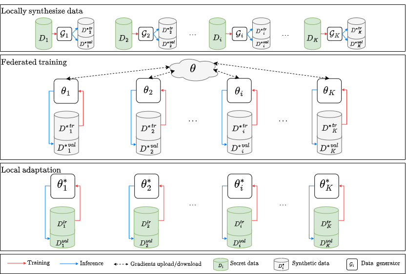

# Personalized Privacy-Preserving Framework for Cross-Silo Federated Learning

This repository contains the code and experiments for the paper: Personalized Privacy-Preserving Framework for
Cross-Silo Federated Learning

## Introduction

Federated learning (FL) is recently surging as a promising decentralized deep learning (DL) framework that enables
DL-based approaches trained collaboratively across clients without sharing private data. However, in the context of the
central party being active and dishonest, the data of individual clients might be perfectly reconstructed, leading to
the high
possibility of sensitive information being leaked. Moreover, FL also suffers from the nonindependent and identically
distributed (non-IID) data
among clients, resulting in the degradation in the inference performance on local clients’ data. In this paper, we
propose a novel
framework, namely Personalized Privacy-Preserving Federated Learning (PPPFL), with a concentration on cross-silo FL to
overcome these
challenges. Specifically, we introduce a stabilized variant of the Model-Agnostic Meta-Learning (MAML) algorithm to
collaboratively
train a global initialization from clients’ synthetic data generated by Differential Private Generative Adversarial
Networks (DP-GANs).
After reaching convergence, the global initialization will be locally adapted by the clients to their private data.
Through extensive
experiments, we empirically show that our proposed framework outperforms multiple FL baselines on different datasets,
including MNIST, Fashion-MNIST, CIFAR-10, and CIFAR-100.



The overall architecture of the PPPFL framework consists of three consecutive stages.
First, each participant locally synthesizes DP-guaranteed dataset ${D^*}$ by training their own DP-data-generator
$\mathcal{G}$ from secret dataset $D$.
Next, in the federated training process, the synthetic data, which have been respectively separated into a training set
${D^*}^{tr}$ and held-out validation set ${D^*}^{val}$, will be used to update the global model parameters $\theta$.
Lastly, the clients emerge from the federated training rounds and perform updates to their local model parameters
$\theta^{*}$ based on their secret training data $D^{tr}$ and evaluate their new locally adapted model with respect to
the secret validation set $D^{val}$.

## Usage

### Using submodules

This repository contains submodules. To clone this repository, please run

```
git clone --recurse-submodules 
```

### Dataset generation

We adopt [DataLens](https://arxiv.org/abs/2103.11109) for the DP-guaranteed synthetic data generation.
Please refer to [this README](DataLens/README.md) for more details.

We use LEAF data format for the dataset. Please refer to [this README](leaf/README.md). The datasets should be placed in
the `datasets/[dataset_name]` folder.

### Dependencies

The experiments are conducted with Python 3.8 and PyTorch 1.7.1.
Please install the dependencies by running

```
pip install -r requirements.txt
```

## Run Experiments

### CIFAR-10

```bash
    python run.py --algo fedmeta --data cifar10 --lr 3e-4 --num_epochs 1 --model=cnn \
    --clients_per_round 5 --batch_size 64 --data_format pkl --num_rounds 30 --meta_algo=maml --outer_lr=3e-4 \
    --result_prefix ./cifar10_results --device cuda:0 --wd 1e-6 --use_pppfl 
```

### CIFAR-100

```bash
    python run.py --algo fedmeta --data cifar100 --lr 3e-4 --num_epochs 1 --model=cnn \
    --clients_per_round 5 --batch_size 64 --data_format pkl --num_rounds 30 --meta_algo=maml --outer_lr=3e-4 \
    --result_prefix ./cifar100_results --device cuda:0 --wd 1e-6 --use_pppfl 
```

### MNIST

```bash
    python run.py --algo fedmeta --data mnist --lr 3e-4 --num_epochs 1 --model=cnn \
    --clients_per_round 5 --batch_size 64 --data_format pkl --num_rounds 30 --meta_algo=maml --outer_lr=3e-4 \
    --result_prefix ./mnist_results --device cuda:0 --wd 1e-6 --use_pppfl 
```

### Fashion-MNIST

```bash
    python run.py --algo fedmeta --data fmnist --lr 3e-4 --num_epochs 1 --model=cnn \
    --clients_per_round 5 --batch_size 64 --data_format pkl --num_rounds 30 --meta_algo=maml --outer_lr=3e-4 \
    --result_prefix ./fmnist_results --device cuda:0 --wd 1e-6 --use_pppfl 
```

## Training arguments

- `algo`: FL algorithm, e.g., fedavg, fedmeta.
- `data`: Dataset, e.g., mnist, cifar10, cifar100, fmnist.
- `lr`: Inner learning rate.
- `num_epochs`: Number of local epochs.
- `model`: Model architecture, e.g., cnn, resnet18.
- `clients_per_round`: Number of clients per round.
- `batch_size`: Batch size.
- `data_format`: Data format, e.g., pkl, hdf5.
- `num_rounds`: Number of communication rounds.
- `meta_algo`: Meta-learning algorithm, e.g., maml, reptile.
- `outer_lr`: Outer learning rate.
- `result_prefix`: Prefix of the result file.
- `device`: Device, e.g., cuda:0.
- `wd`: Weight decay.
- `use_pppfl`: Whether to use PPPFL.

## Acknowledgement

We would like to thank the authors from [Xtra-Computing](https://github.com/Xtra-Computing), 
[AI-Secure](https://github.com/AI-secure), [TalwalkarLab](https://github.com/TalwalkarLab) and [Shu](https://github.com/ddayzzz/)
for their open-source implementations.

